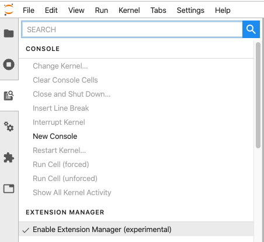
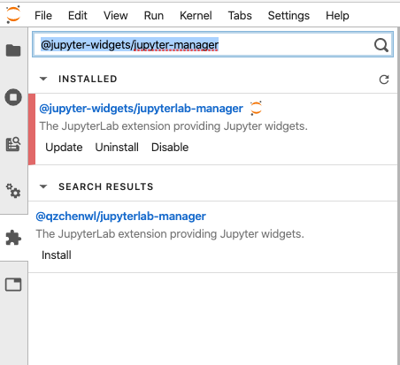
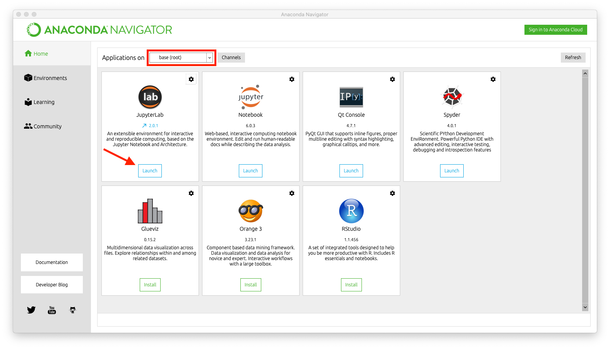

# Output 

Results for multiple control policies and particularly vanishing output policiles

#### Reproducibility of results  

In order to reproduce the environment setup the environment for reproducibility of results. 

* A notebook containing evolution: [01_Zone_Characterisation.ipynb](01_Zone_Characterisation.ipynb). 

* A notebook containing analytics: [02_Outcome_analysis.ipynb](02_Outcome_analysis.ipynb)  

* Al result data is stored in the folder `results/`

### Environment setup

The basic environment setup consists in installation of a minimum set of packages that will allow the reproducibility of the conditions and results. 

#### Minimum requirements

Be sure to have a version of Anaconda or download it [here](https://www.anaconda.com/distribution/). 

The following guidelines are meant to be executed in the terminal console: 

#### Create working environment

Open a bash terminal and execute: 

```
$conda env create -f=environemnt.yaml
```
#### Activate working environment

You may have access to the environment by activating it

```
$conda activate isttt24
```

or via the graphical interface. Select the drop down menu `Appplications on`


#### Setup extensions 

Via the command line interface:

```
$jupyter labextension install @jupyter-widgets/jupyterlab-manager 
```

Via the jupyter lab interface. Consider first launching the application (See down below)

**Installation** 
Consider latest version of `jupyterlab>= 2.0`. From the side menu enable the experimental extension manager

   

**Activation**
Look for and install the widget extension manager called `@jupyter-widgets/jupyter-manager` and click under install/update. 
 


#### Launch the environment and simulations

Launch the simulations via the command line or

``` 
$cd ~
$jupyter lab 
```

Graphical interface. Be sure to select the correct environment before launching the `jupyter lab` application



Double click and open the corresponding notebook

